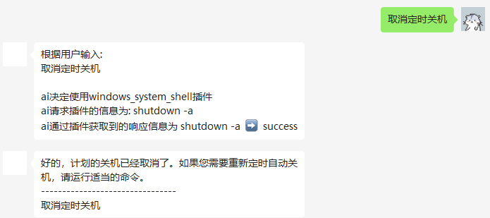

# 本地与线上打通

> 我将通过开发一个关机小插件的方式，来演示如何将本地的电脑与服务器上的项目打通。
> 项目 地址为 api.whyiyhw.com

## frps && frpc 相关的安装

<details>
<summary>点击展开</summary>
</details>

### 服务端 转发
- docker 安装 frp 服务端
```shell
mkdir -p /data/frp

vim /data/frp/frps.ini
```

```ini
[common]
bind_addr = 0.0.0.0
#frp监听的端口，默认是7000
bind_port = 7000
# 授权码，请改成更复杂的
token = xxxxxxxxxxxxxxxxxxxxxxxx

# 开启转发
vhost_http_port = 7000
vhost_http_timeout = 600

# frp管理后台端口，请按自己需求更改
dashboard_port = 7500
# frp管理后台用户名和密码，请改成自己的
dashboard_user = xxxxxx
dashboard_pwd = xxxxxx
# 不开启监控
enable_prometheus = false

# frp日志配置
log_file = console
log_level = info
log_max_days = 3
```

- 在外网环境下，使用以下配置直接下载

```shell
vim /data/frp/Dockerfile
```

```dockerfile
FROM alpine:3.8

ENV VERSION 0.48.0
ENV TZ=Asia/Shanghai
WORKDIR /

RUN apk add --no-cache tzdata \
    && ln -snf /usr/share/zoneinfo/${TZ} /etc/localtime \
    && echo ${TZ} > /etc/timezone

RUN if [ "$(uname -m)" = "x86_64" ]; then export PLATFORM=amd64 ; else if [ "$(uname -m)" = "aarch64" ]; then export PLATFORM=arm64 ; fi fi \
	&& wget --no-check-certificate https://github.com/fatedier/frp/releases/download/v${VERSION}/frp_${VERSION}_linux_${PLATFORM}.tar.gz \ 
	&& tar xzf frp_${VERSION}_linux_${PLATFORM}.tar.gz \
	&& cd frp_${VERSION}_linux_${PLATFORM} \
	&& mkdir /frp \
	&& mv frps frps.ini /frp \
	&& cd .. \
	&& rm -rf *.tar.gz frp_${VERSION}_linux_${PLATFORM}

VOLUME /frp

CMD /frp/frps -c /frp/frps.ini
```
- 在内部网络的情况下

```shell
# 自行想办法下载 frp_0.48.0_linux_amd64.tar.gz

cd /data/frp
curl -x socks5://127.0.0.1:1080 -o frp_0.48.0_linux_amd64.tar.gz -L https://github.com/fatedier/frp/releases/download/v0.48.0/frp_0.48.0_linux_amd64.tar.gz
```
- 再执行 `vim /data/frp/Dockerfile`
```dockerfile
FROM alpine:3.8

ENV VERSION 0.48.0
ENV PLATFORM amd64
ENV TZ=Asia/Shanghai
WORKDIR /

RUN ping -c 1 -W 1 google.com > /dev/null \
    && echo "外部服务器-无需加入任何配置" \
    || sed -i 's/dl-cdn.alpinelinux.org/mirrors.aliyun.com/g' /etc/apk/repositories

RUN apk add --no-cache tzdata \
    && ln -snf /usr/share/zoneinfo/${TZ} /etc/localtime \
    && echo ${TZ} > /etc/timezone 
    
COPY ./frp_0.48.0_linux_amd64.tar.gz ./frp_0.48.0_linux_amd64.tar.gz

RUN tar xzf frp_${VERSION}_linux_${PLATFORM}.tar.gz \
	&& cd frp_${VERSION}_linux_${PLATFORM} \
	&& mkdir /frp \
	&& mv frps frps.ini /frp \
	&& cd .. \
	&& rm -rf *.tar.gz frp_${VERSION}_linux_${PLATFORM}

VOLUME /frp

CMD /frp/frps -c /frp/frps.ini
```

```shell
# build image
cd /data/frp && docker build -t whyiyhw/frps .

# run frps
docker run -it -d --name frps --restart=always -v /data/frp/frps.ini:/frp/frps.ini --privileged --network=host whyiyhw/frps
```
- 此时服务端就运行完成，打开 7000 跟7500 端口限制即可

### 本地端 接收
- [https://github.com/fatedier/frp/releases](https://github.com/fatedier/frp/releases)
- 我本地 是 windows 所以下载 `https://github.com/fatedier/frp/releases/download/v0.47.0/frp_0.47.0_windows_amd64.zip`
- 解压后，修改 `frpc.ini` 配置文件
```ini
[common]
server_addr = 服务器ip
# 请换成 frps 设置的服务器端口 bind_port
server_port = 7000
# 请换成 frps 设置的 token
token = xxxxxx

[web02]
type = http
local_ip = 127.0.0.1
local_port = 8886
custom_domains = api.whyiyhw.com
```
- 然后命令行启动 frpc.exe 就好

### 如何沟通服务端到本地，与接入企业微信

- 我们确认了 frps 会将请求
- http://{custom_domains}:{vhost_http_port}  也就是 `http://api.whyiyhw.com:7000`
- 转发到 frpc , 那么设置下 nginx 代理
```conf
server {
    listen 7512;
    server_name localhost;

    location / {
      proxy_pass http://api.whyiyhw.com:7000;
    }
}
```
- 再修改服务器 host
```shell
vim /etc/hosts

# 加入
127.0.0.1       api.whyiyhw.com
```

## shell 命令行插件的开发 可见 `plugins/webhook`

最终实现的效果


- 此时你就可以通过 这个对话机器人，控制你本地电脑的关闭。对于一个躺下就不想爬起来的人来说。
- 看起来很沙雕的操作，确实十分舒适