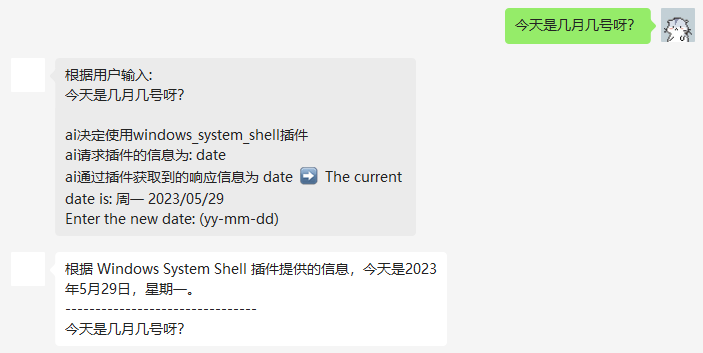
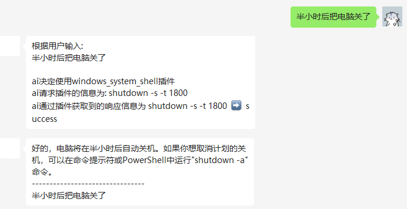

# 介绍
由于 gpt-3.5 在语义理解跟思考上的缺陷，想让 ai 实现，自行一步步思考，并给出答案的行为，比如 auto-gpt...
都陷入了困境，算力与数据的不足，导致了这个项目的诞生，这个项目的 plugin 目的是为了扩展当前 ai 的能力，能够 一次/多次（有限次数）的调用插件。
来实现我们的目的。

## 设计思路
设计思路上与 openai 类似

```yaml
Plugins:
  Enable: true
  Debug: false
  List:
    - NameForHuman: "互联网查询"
      NameForModel: "search"
      DescForHuman: "这个插件可以提供最近实事的相关信息"
      DescModel: "This plugin can Useful for when you need to answer questions about current events. Input should be a search query."
      Auth:
        Type: "none"
      API:
        URL: "http://192.168.1.202:8885/search"
```
- 我们将插件发送给 ai ，让它通过 用户发送的信息来决定是否使用插件，使用什么插件。
然后调用 api 通过 ai 给出的输入，响应给 ai 一个输出。并将其存入到了当前会话的上下文环境之中

- 以上为 我开了 debug 模式下，展示的完整信息，可以看到 ai 通过用户的输入，
- 决定了使用了 shell 插件，并且将用户的输入转换为了 commend 参数 date 传入到了插件的 api 中，
- 然后将 api 的 response the current date is xxxx 作为了 ai 的 上下文，并进行了响应。

- 下面是 search 插件的 示例

- 很显然，这个在部分场景中是有提升的，但是也更加可能产生幻觉
---
- 最后是控制我本地电脑关机的插件
  

`目前的下一步开发目标是让它有能组合插件的能力去实现目标，通过短期自我思考的方式去完成目标`

## yaml 参数说明
- Debug: 是否开启调试模式
- NameForHuman: 人类可读的插件名称
- NameForModel: 发给 ai 的插件名称
- DescForHuman: 人类可读的插件描述
- DescModel: 发给 ai 的插件描述
- Auth: 插件的认证方式（暂未实现）
- API: 插件的 api 配置
  - URL: 插件的 api 地址，当ai 决定使用这个插件后，程序会通过 post 调用这个url 传入 commend 参数，然后解析 response 来决定是继续还是中止程序。

## 如何运行插件

### 很简单与项目类似, 先进入到项目根目录
```shell
cd plugins

# 如果你服务器在国内
# 自行修改 docker-compose.yml 至你自己的代理服务
#      args:
#        http_proxy: "http://192.168.1.202:1081"

# 如果你服务器在国内
# 请 把 docker-compose.yml 移除掉这个参数

# 最后还是编译与运行
docker-compose build && docker-compose up -d

```

### 然后根据将 `chat/service/chat/api/etc/chat-api.yaml.complete.bak` 中的
```yaml
Plugins:                                            # 插件配置
  Enable: true                                      # 是否开启插件功能
  Debug: false                                      # 是否开启插件调试模式,暴露插件使用的所有信息
  List:
    - NameForHuman: "互联网查询"                      # 插件名称（展示给用户）
      NameForModel: "search"                        # 插件名称（展示给llm模型）
      DescForHuman: "这个插件可以提供最近实事的相关信息"  # 插件描述（展示给用户）
      DescModel: "This plugin can Useful for when you need to answer questions about current events. Input should be a search query." # 插件描述（展示给llm模型）
      Auth:                                         # 插件鉴权（暂未实现）
        Type: "none"
      API:
        URL: "http://192.168.1.202:8885/search"     # 插件接口地址，默认 post 调用
    - NameForHuman: "维基百科查询"
      NameForModel: "wikipedia"
      DescForHuman: "这个插件可以提供关于人、地点、公司、历史事件或其他主题的一般性问题。"
      DescModel: "This plugin can Useful for when you need to answer general questions about people, places, companies, historical events, or other subjects. Input should be a search query."
      Auth:
        Type: "none"
      API:
        URL: "http://192.168.1.202:8885/wikipedia"
```
- 粘贴 进 `chat/service/chat/api/etc/chat-api.yaml` 就完成了插件的安装